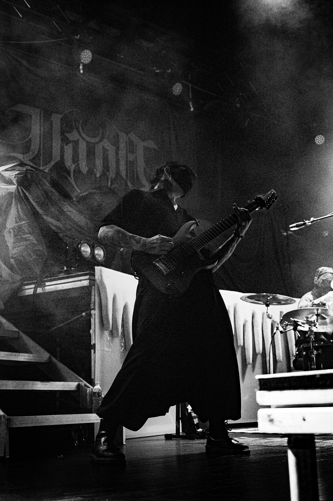

# Website-dev
<!DOCTYPE html>
<html lang="en">
<head>
   <meta charset="UTF-8">
   <meta name="viewpoint" content="width=device-width, initial-scale=1.0">
   <link href="https://fonts.googleapis.com/css2?family=Viaoda+Libre&display=swap" rel="stylesheet">

</head>
<body>
    <h1>Jamie Baker - Music Photographer</h1>
    

        <a href="Gallery.html" class="image-container">
     
Gallery
</a> 

         <a href="Contact.html" class="image-container">
    
    
Contact

          </a>

        <a href="About.html" class="image-container"> 
    
    
About Me

        </a>

  

<footer>
   

      &copy; 2026 Jamie Baker
      <a href="https://www.instagram.com/j.bakermedia" target="_blank">Instagram</a>
   

</footer>
</body>
</html>
   

</footer>
      
